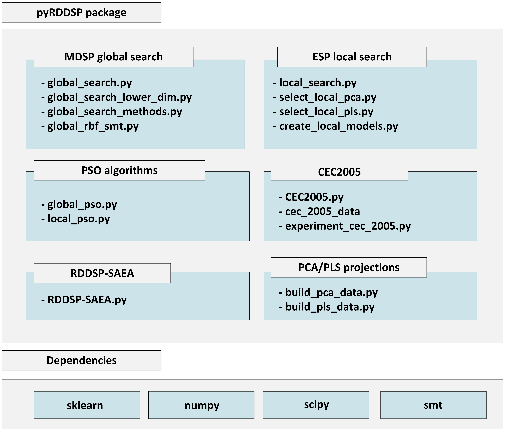

# Summary 

Traditional Evolutionary Algorithms (EAs) and Surrogate-Assisted Evolutionary Algorithms (SAEAs) have been successfully applied to a wide range of optimization problems. However, in the context of expensive optimization, the computational budget is often highly constrained. The limited number of fitness evaluations available in such scenarios poses a significant challenge for both EAs and SAEAs. Even specialized algorithms designed for large-scale optimization [@lgso1, @lgso2, @lgso3], which specifically target high-dimensional data, do not always yield satisfactory results due to these limitations.

Expensive optimization problems can require several hours for a single cost function evaluation and may demand specialized hardware and engineering capabilities. Examples include aircraft wing shape optimization [@Jichao2021wingopt], vehicle crash safety design [@Liao08carcrash, @Assoucarcrash19], meteorological simulations [@choi23, @WangWeather23], and Finite Element Method (FEM) problems [@Kalita21_FEM], where evolutionary optimization is particularly difficult due to the high computational cost.

The pyRDDSP package is an implementation of RDDSP-SAEA, a surrogate assisted evolutionary algorithm for high-dimensional expensive problems. RDDSP-SAEA is based on DSP-SAEA [@DSPSAEA23] and evolved the global-local search approach of DSP-SAEA by incorporating an Enhanced Surrogate Pool (ESP) strategy for local search and Multi-Decision Space Partitioning (MDSP) for global search. 

RDDSP-SAEA implemented in pyRDDSP follows the design of global-local search. This algorithm structure is composed of two main parts [@saea1]: 1) global-search - responsible for exploration and usually based on surrogate models trained in the global search space. 2) Local search stage - responsible for exploitation and usually based on surrogate models trained in restricted regions of the search space. In pyRDDSP, global search is based on the MDSP strategy and local search is based on ESP strategy. Both phases rely on PCA and PLS dimension reduction techniques to produce multiple lower-dimensional spaces and surrogates trained with a reduced number of variables. With the multiple surrogates trained across different space projections, the algorithm is able to select the best surrogate models even for expensive high-dimensional data sets. 

In addition to the RDSSP-SAEA algorithm itself, pyRDDSP also brings CEC2005 [@cec2005] test problem suite integrated in the package. The CEC2005 class from pyRDSSP allows users to easily instantiate and use CEC2005 test problems. This test suite is widely used by the optimization community and the implementation provided in pyRDDSP expands the original test suite to include test data for 300, 500 and 700 variables, while the original implementation has a limit of 100 variables. 

The main contributions of RDDSP algorithm and pyRDDSP package are:

- Introduction of RDDSP-SAEA, a competitive surrogate assisted algorithm for expensive high-dimensional problems.
- Integrated CEC2005 test suite for experimental analysis and design.
- MDSP - Multi-Decision Space Partitioning approach for global search. A strategy where multiple lower-dimensional spaces are clustered and partitioned. RBF surrogates are trained for each of the cluster regions across the multiple decision spaces, and only the decision space that yields the best surrogates is selected to be used for further optimization.
- ESP strategy for local search. Multiple surrogate modeling techniques are applied (RBF, Kriging, Polynomial Regression and surrogate ensembles) and trained on both the original decision space and lower-dimensional spaces produced by a combined form of PCA/PLS techniques. PLS and PCA are used together so that the algorithm can select the projections that yield the best models.

*Figure 1: pyRDDSP package organization*

# Statement of need

The pyRDDSP package is the first implementation of RDDSP-SAEA and allows users to easily integrate and test RDDSP-SAEA into their optimization problems. RDDSP-SAEA is an effective algorithm developed as an evolution of DSP-SAEA. This framework is effective for problems up to 500 variables with a very limited computational budget of just a few hundred of fitness evaluations, while the overall literature relies on computational budgets of at least one thousand or more fitness evaluations for high-dimensional expensive problems.

To the best of our knowledge, there is no  publicly available implementation of this algorithm. In addition to that, pyRDDSP implementation of the CEC2005 test suite is an expanded version that includes test data for 300, 500 and 700 variables, allowing users to explore this classical test suite in high-dimensional scenarios.

# Acknowledgements

The authors would like to thank all the reviewers for their constructive comments. This work was supported by Brazilian agencies FAPEMIG (Research Support Foundation of the State of Minas Gerais), CNPq (The National Council for Scientific and Technological Development), CAPES (Coordination for the Improvement of Higher Education Personnel), and the Operations Research and Complex Systems Laboratory (ORCS Lab./UFMG)\footnote{https://orcslab.github.io/}. Professor Lucas S. Batista is a FAPEMIG-CNPQ scholarship holder (process APQ-06716-24).

# References
